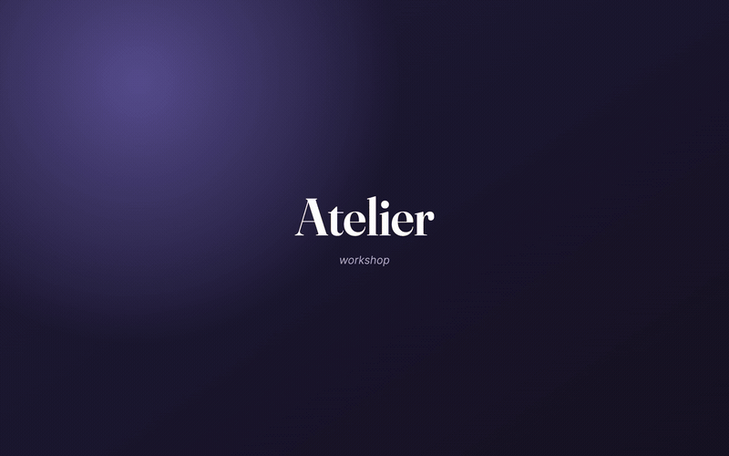

# 🛠️ Atelier

*workshop.*



*▶ [Full demo, with sound (MP4)](docs/demo.mp4)*

## What this is 🧭

Atelier gives AI coding agents a backbone. You hand it a goal; it locks in a North
Star, a set of outcomes, then 'loops' through phases and verifies and realigns when
it drifts off target.

You can do things like:

- **Film a product demo.** It scripts the shots, records an MP4 walkthrough, and
  judges it shot by shot until it meets your bar. Give it comments and it'll self
  improve and refine (this is how the demo in the repo was made!).
- **Train a custom image model.** Teach an image generator your character, product,
  or art style from a handful of examples (a LoRA). It's normally a finicky loop of
  train, generate a batch, squint, adjust, retrain, so Atelier runs it for you: it
  trains, judges the samples against the look you're after, and goes back to retrain
  until the model actually produces it.
- **Create a YouTube channel intro.** Give it your channel's vibe and a reference
  you like. It builds and renders the intro, judges it against that reference, and
  redoes whatever falls short.

And you don't have to drive it alone: your whole team can watch the same board,
comment on a mock or a moment in the QA video, and it folds that feedback into what
it does next.

## Features ✨

*How a run works:*

- 🔁 **Loops are YAML** (`machines/*.yaml`). Ordered phases with reject arcs that
  send failed work back a step. Edit a loop in the UI or the file, or let AI draft
  one from a description. (Four ship with Atelier; see below.)
- 🎼 **The Conductor.** A per-loop agent that reads every open comment, picks the
  earliest phase to re-enter, and briefs the worker (auto or propose-first). You
  can also just talk to it.
- 🔬 **QA that runs the app.** Boots the dev server, logs in with the repo's own
  test fixtures, tests the feature case by case, and vision-verifies the captures.
  Each case lands as its own `PASS`/`FAIL` deliverable.
- 🚗 **Test-drive the result.** One button boots the app, restores the test login,
  and opens a real Chrome on the feature.
- 🧠 **Loops that learn** *(opt-in)*. Feedback distills into durable principles
  applied to future runs; a guarded mode can even grow the loop a new phase.

*Working with others:*

- 💬 **Comment on anything, anytime.** Pins on mocks, timestamped notes on QA
  videos, quotes on specs. Threaded, signed, with `@mentions` and live presence.
- 🤝 **Built to share.** One password-gated instance; teammates install nothing.
  It also parses and visualizes the [Claude Code workflows](https://code.claude.com/docs/en/workflows)
  already in your repo.

*Where and how it runs:*

- 🎛 **Any model, per phase.** Claude or Ollama-Cloud models (GLM, Qwen, DeepSeek,
  Kimi), each driving the full Claude Code harness. Pin a specific model to a
  single phase.
- 🖥️ **Web, terminal, and phone.** The board in a browser; a full-screen terminal
  UI over the same API (see [The terminal UI](#the-terminal-ui-️)); and a calm
  phone mode with the status, the latest deliverable, and two buttons: keep going,
  or ask for a change.

## Example loops 🧬

A loop is a handful of states in a YAML file. Four ship with Atelier:

- **Ship a feature** (`repo-pipeline.yaml`):
  `PRD → Spec → Mock → Build → Review → QA → Acceptance → Open PR`.
  Review, QA, and Acceptance can each reject work back to Build.
- **Meet a goal** (`goal-loop.yaml`): `Brief → Make → Evaluate ↺ → Deliver`.
  Anything with checkable success criteria: a doc, a design, a dataset.
- **Get unstuck** (`goal-seeker.yaml`): `Anchor → Attempt → Evaluate ↺ Unblock`.
  When an attempt stalls, it researches how others solved it and tries a
  genuinely different approach instead of retrying the same failing thing.
- **Collect images** (`image-collector.yaml`): `Brief → Collect → Curate ↺ → Package`.
  Vision-checks every image against the spec and zips the accepted ones.

Here is one you could write yourself, a product demo loop that records a video
of your app in its entirety:

```yaml
id: product-demo
name: Product demo - Script → Record → Judge ↺ → Deliver
states:
  - id: script
    name: Script
    gate: true
    tools: [read_file, list_directory, run_command, display_artifact]
    prompt: |-
      Explore the app and write a shot-by-shot demo script for the goal's
      feature. display_artifact it, then request_approval.
  - id: record
    name: Record
    tools: [start_dev_server, authenticate, record_walkthrough, display_artifact]
    prompt: |-
      Boot the app, log in, and record the script as an MP4 walkthrough.
      display_artifact the video, then request_approval.
  - id: judge
    name: Judge
    rejectTo: record
    tools: [gemini_eval, display_artifact]
    prompt: |-
      Judge the video shot by shot against the script - clean surfaces, the
      feature actually visible, readable framing. Reject with specifics
      (loops back to Record) or request_approval.
  - id: deliver
    name: Deliver
    output: { file: demo.mp4, label: the finished demo video }
    tools: [run_command, display_artifact]
    prompt: |-
      Place the final cut at demo.mp4 - the phase exposes it as a Download.
      display_artifact a summary, then request_approval.
```

You don't have to touch YAML, either. The same loops open in the UI as a
node-graph editor (`/machines`) where you add a state, wire a reject arc, attach
tools, and pin a model. Or let AI draft the whole loop from a description.

## Run it 🚀

You need **Node 20+**, a **model CLI logged in** (the **[Claude Code](https://claude.com/claude-code)**
CLI (`claude`) for Claude models and/or **[Ollama](https://ollama.com)** (`ollama`) for the
GLM/Qwen/Kimi models), the **[GitHub CLI](https://cli.github.com)** (`gh auth login`), and **Google
Chrome**. Model auth is the CLI login, not an env key. Optional: `ffmpeg` (QA video),
`GEMINI_API_KEY` (video judging).

```bash
git clone https://github.com/andrsnn/atelier.git
cd atelier
./setup.sh        # macOS/Linux: checks prereqs, installs deps, scaffolds config, builds
```

On **Windows**, run the PowerShell equivalent instead:

```powershell
powershell -ExecutionPolicy Bypass -File setup.ps1
```

1. Log into your model CLI: `claude` (Claude models) and/or `ollama` (GLM/Qwen/Kimi)
2. `npm start` → **http://localhost:7777**
3. In the UI, **add a repo folder** (or run in a scratch workspace) and start a loop. No config files to hand-edit.

Open the board → **New loop** → write a goal, pick the repo and model, go.
Atelier cuts a git worktree off your base branch and the agent works there for
real. Pick how much to supervise: **⏸ All** (review every step) · **◐ Loop**
(each state's gate) · **⏩ Auto** (unattended, straight to a PR).

## The terminal UI ⌨️

`atelier` is the whole factory from a terminal: a full-screen TUI with zero
dependencies, a pure client of the same HTTP API as the board. Leave it up on a
monitor for the live board, a run cockpit with an ASCII graph of the machine,
approvals and routing, and a full loop editor.

```bash
npm run tui                                   # this machine's factory
node cli/atelier.mjs --url http://host:7777   # anyone else's
```

Keys, views, and options in [docs/reference.md](docs/reference.md#the-terminal-interface).

## Share it 👥

Run Atelier on the machine that has the repos, the `gh` login, and the model
keys. Teammates just point a browser (or the TUI) at it. Set `ACCESS_PASSWORD`
in `.env.local`, hand out the LAN or tunnel URL, and everyone comments on the
same runs under their own name. From a phone, a [Tailscale](https://tailscale.com)
tailnet plus Simple mode works well. For an always-on host (systemd, headless
capture, shared URLs), see [docs/deploy.md](docs/deploy.md).

Worth knowing: one password means full access; the host has to stay awake; and
the Test-it dev server is visible to your network while it's up.

## Under the hood 🔩

```
machines/*.yaml              the loops - data, not code
app/lib/engine/tools.ts      the tool registry - the only imperative code
app/lib/engine/runner.ts     the generic state driver
app/lib/engine/conductor.ts  feedback → routing
app/lib/engine/reflect.ts    self-learning: feedback → principles
app/runs/[id]                the run page (deliverables, comments, Conductor)
cli/                         atelier - the terminal UI
```

**The one rule:** state machine with tools, no deterministic pipeline code. To
make Atelier do something new, add or improve a **tool**, or write a better
**prompt** for a state. Never a new branch in the engine. Rationale in
[CLAUDE.md](CLAUDE.md).

A state is `{ id, name, prompt, tools[], gate?, rejectTo?, model?, … }`. Tools
range from `read_file` and `run_command` to `start_dev_server`,
`record_walkthrough`, `gemini_eval`, `watch_pr`, and `test_drive`. The full
reference (machines, tools, projects, env vars, the terminal UI, team caveats)
is in [docs/reference.md](docs/reference.md).
